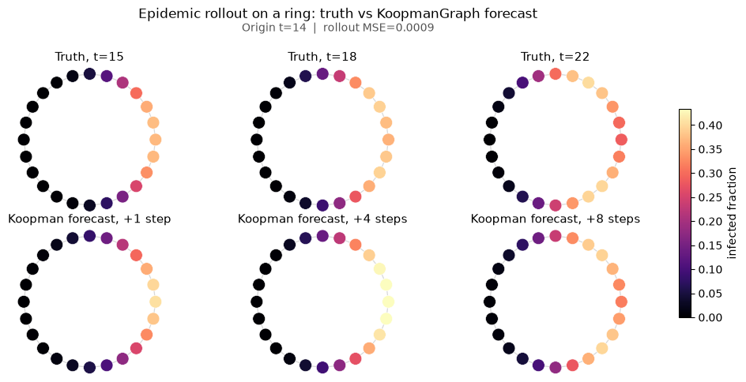
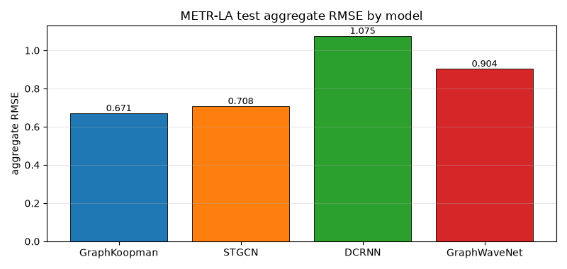

Tutorials
=========

Jupyter tutorials live under the repository
`examples/ <https://github.com/tjkessler/KoopmanGraph/tree/main/examples>`_
directory. This page is the full gallery; the README highlights a few
representative results.

Featured results
----------------

Epidemic truth vs forecast
~~~~~~~~~~~~~~~~~~~~~~~~~~

Schur-stable SIR wave on a ring graph (notebook 06). Low open-loop rollout
MSE on this teaching example; see the notebook for protocol and caveats.

METR-LA teaching-baseline comparison
~~~~~~~~~~~~~~~~~~~~~~~~~~~~~~~~~~~~

Protocol-matched aggregate RMSE on a METR-LA cache (notebook 22). Bars are
**in-repo teaching baselines**, not dedicated-library SOTA implementations.

Architecture overview
~~~~~~~~~~~~~~~~~~~~~

.. image:: _static/architecture-overview.svg
   :alt: Encode, linear Koopman advance, and decode pipeline
   :width: 100%

Notebook gallery
----------------

Forecasting and benchmarks
~~~~~~~~~~~~~~~~~~~~~~~~~~

.. list-table::
   :header-rows: 1
   :widths: 38 62

   * - Notebook
     - Topic
   * - `01_synthetic_graph.ipynb <https://github.com/tjkessler/KoopmanGraph/blob/main/examples/01_synthetic_graph.ipynb>`_
     - End-to-end synthetic graph dynamics
   * - `02_ieee118_bus.ipynb <https://github.com/tjkessler/KoopmanGraph/blob/main/examples/02_ieee118_bus.ipynb>`_
     - IEEE 118-bus Vm forecasting with honest DMDc comparison
   * - `03_traffic_network.ipynb <https://github.com/tjkessler/KoopmanGraph/blob/main/examples/03_traffic_network.ipynb>`_
     - METR-LA chronological split vs DMD/EDMD
   * - `06_epidemic_ring.ipynb <https://github.com/tjkessler/KoopmanGraph/blob/main/examples/06_epidemic_ring.ipynb>`_
     - SIR ring wave with Schur-stable spectrum
   * - `22_gnn_forecaster_comparison.ipynb <https://github.com/tjkessler/KoopmanGraph/blob/main/examples/22_gnn_forecaster_comparison.ipynb>`_
     - GraphKoopman vs STGCN / DCRNN / Graph WaveNet references
   * - `24_nonlinear_chaotic_benchmarks.ipynb <https://github.com/tjkessler/KoopmanGraph/blob/main/examples/24_nonlinear_chaotic_benchmarks.ipynb>`_
     - Nonlinear/chaotic graph benchmarks vs linear vector DMD

Analysis and stability
~~~~~~~~~~~~~~~~~~~~~~

.. list-table::
   :header-rows: 1
   :widths: 38 62

   * - Notebook
     - Topic
   * - `04_grid_attention.ipynb <https://github.com/tjkessler/KoopmanGraph/blob/main/examples/04_grid_attention.ipynb>`_
     - GAT encoder on grid graphs
   * - `07_koopman_spectrum.ipynb <https://github.com/tjkessler/KoopmanGraph/blob/main/examples/07_koopman_spectrum.ipynb>`_
     - Koopman eigenvalue analysis
   * - `08_loss_stability.ipynb <https://github.com/tjkessler/KoopmanGraph/blob/main/examples/08_loss_stability.ipynb>`_
     - Loss weighting and soft stability regularization
   * - `26_sparse_interpretable_operator.ipynb <https://github.com/tjkessler/KoopmanGraph/blob/main/examples/26_sparse_interpretable_operator.ipynb>`_
     - :math:`L_1` Koopman sparsity + worst-case reconstruction (latent :math:`K` sparsity ≠ physical adjacency)
   * - `09_topology_ablation.ipynb <https://github.com/tjkessler/KoopmanGraph/blob/main/examples/09_topology_ablation.ipynb>`_
     - Topology ablation + GCN/SAGE/DiffConv/Transformer encoder zoo on anisotropic advection
   * - `11_long_horizon_stability.ipynb <https://github.com/tjkessler/KoopmanGraph/blob/main/examples/11_long_horizon_stability.ipynb>`_
     - Structural stability parameterizations, long rollouts
   * - `16_spectral_similarity_anomalies.ipynb <https://github.com/tjkessler/KoopmanGraph/blob/main/examples/16_spectral_similarity_anomalies.ipynb>`_
     - Spectral distance clustering and anomaly detection
   * - `21_uncertainty_quantification.ipynb <https://github.com/tjkessler/KoopmanGraph/blob/main/examples/21_uncertainty_quantification.ipynb>`_
     - Deep-ensemble and latent-Gaussian predictive intervals (``koopman_graph.uq``)
   * - `23_hierarchical_multiresolution.ipynb <https://github.com/tjkessler/KoopmanGraph/blob/main/examples/23_hierarchical_multiresolution.ipynb>`_
     - Hierarchical TopK pool / unpool vs flat model (in-sample RMSE + spectrum; not P-K-GCN SR)

Control, observation, and advanced dynamics
~~~~~~~~~~~~~~~~~~~~~~~~~~~~~~~~~~~~~~~~~~~

.. list-table::
   :header-rows: 1
   :widths: 38 62

   * - Notebook
     - Topic
   * - `05_custom_data.ipynb <https://github.com/tjkessler/KoopmanGraph/blob/main/examples/05_custom_data.ipynb>`_
     - Bring your own graph sequences
   * - `10_advanced_training.ipynb <https://github.com/tjkessler/KoopmanGraph/blob/main/examples/10_advanced_training.ipynb>`_
     - Schedulers, rollout origins, multi-trajectory ``fit``
   * - `12_irregular_sampling_continuous_time.ipynb <https://github.com/tjkessler/KoopmanGraph/blob/main/examples/12_irregular_sampling_continuous_time.ipynb>`_
     - Continuous-time generator, irregular Δt, ``predict_at``
   * - `20_continuous_spectrum_auxiliary_network.ipynb <https://github.com/tjkessler/KoopmanGraph/blob/main/examples/20_continuous_spectrum_auxiliary_network.ipynb>`_
     - Parametric continuous spectrum via auxiliary network (local linearity)
   * - `13_online_adaptation_topology_shock.ipynb <https://github.com/tjkessler/KoopmanGraph/blob/main/examples/13_online_adaptation_topology_shock.ipynb>`_
     - Recursive least-squares online adaptation under topology shock
   * - `14_physics_informed_advection.ipynb <https://github.com/tjkessler/KoopmanGraph/blob/main/examples/14_physics_informed_advection.ipynb>`_
     - Hybrid physics observables on directional advection
   * - `15_closed_loop_voltage_control_rl.ipynb <https://github.com/tjkessler/KoopmanGraph/blob/main/examples/15_closed_loop_voltage_control_rl.ipynb>`_
     - Latent PPO on IEEE 118 Vm surrogate
   * - `17_delay_embedding_partial_observability.ipynb <https://github.com/tjkessler/KoopmanGraph/blob/main/examples/17_delay_embedding_partial_observability.ipynb>`_
     - Delay / Hankel encoder under partial observations
   * - `18_networked_koopman_dynamic_topology.ipynb <https://github.com/tjkessler/KoopmanGraph/blob/main/examples/18_networked_koopman_dynamic_topology.ipynb>`_
     - Networked ``koopman="graph"`` under mid-horizon rewiring
   * - `19_bilinear_control_koopman.ipynb <https://github.com/tjkessler/KoopmanGraph/blob/main/examples/19_bilinear_control_koopman.ipynb>`_
     - Bilinear vs additive control (synthetic + SIR intervention)
   * - `25_kalman_koopman_state_estimation.ipynb <https://github.com/tjkessler/KoopmanGraph/blob/main/examples/25_kalman_koopman_state_estimation.ipynb>`_
     - Kalman-Koopman observer / imputation under masks

Related pages
-------------

* :doc:`capabilities` — feature and dataset inventory
* :doc:`quickstart` — minimal train/predict script
* :doc:`api` — API reference
