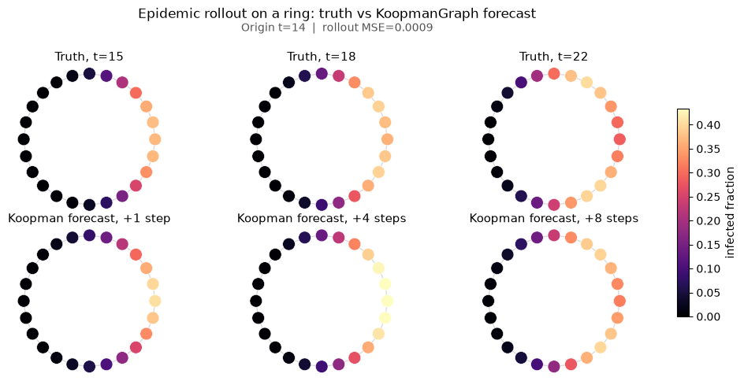
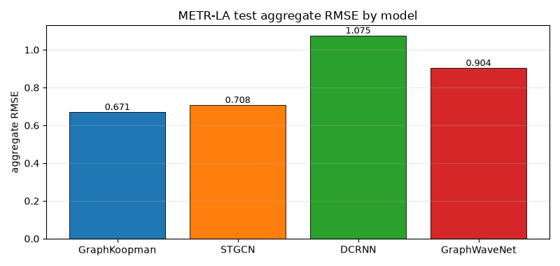

Tutorials
=========

Jupyter tutorials live under the repository
`examples/ <https://github.com/tjkessler/KoopmanGraph/tree/main/examples>`_
directory. This page is the full gallery; the README highlights a few
representative results.

Featured results
----------------

Epidemic truth vs forecast
~~~~~~~~~~~~~~~~~~~~~~~~~~

Schur-stable SIR wave on a ring graph (notebook 06). Low open-loop rollout
MSE on this teaching example; see the notebook for protocol and caveats.

METR-LA teaching-baseline comparison
~~~~~~~~~~~~~~~~~~~~~~~~~~~~~~~~~~~~

Protocol-matched aggregate RMSE on a METR-LA cache (notebook 22). Bars are
**in-repo teaching baselines**, not dedicated-library SOTA implementations.

Architecture overview
~~~~~~~~~~~~~~~~~~~~~

.. image:: _static/architecture-overview.svg
   :alt: Encode, linear Koopman advance, and decode pipeline
   :width: 100%

Notebook gallery
----------------

Forecasting and benchmarks
~~~~~~~~~~~~~~~~~~~~~~~~~~

.. list-table::
   :header-rows: 1
   :widths: 38 62

   * - Notebook
     - Topic
   * - `01_synthetic_graph.ipynb <https://github.com/tjkessler/KoopmanGraph/blob/main/examples/01_synthetic_graph.ipynb>`_
     - End-to-end synthetic graph dynamics
   * - `02_ieee118_bus.ipynb <https://github.com/tjkessler/KoopmanGraph/blob/main/examples/02_ieee118_bus.ipynb>`_
     - IEEE 118-bus Vm forecasting with honest DMDc comparison
   * - `03_traffic_network.ipynb <https://github.com/tjkessler/KoopmanGraph/blob/main/examples/03_traffic_network.ipynb>`_
     - METR-LA chronological split vs DMD/EDMD
   * - `06_epidemic_ring.ipynb <https://github.com/tjkessler/KoopmanGraph/blob/main/examples/06_epidemic_ring.ipynb>`_
     - SIR ring wave with Schur-stable spectrum
   * - `22_gnn_forecaster_comparison.ipynb <https://github.com/tjkessler/KoopmanGraph/blob/main/examples/22_gnn_forecaster_comparison.ipynb>`_
     - GraphKoopman vs STGCN / DCRNN / Graph WaveNet references
   * - `42_traffic_teaching_baselines.ipynb <https://github.com/tjkessler/KoopmanGraph/blob/main/examples/42_traffic_teaching_baselines.ipynb>`_
     - Teaching AGCRN / MTGNN / STGODE on a METR-LA slice, plus GraphCast on a
       separate small weather mesh (deviation tables; not leaderboard or
       METR/PEMS score comparisons)
   * - `24_nonlinear_chaotic_benchmarks.ipynb <https://github.com/tjkessler/KoopmanGraph/blob/main/examples/24_nonlinear_chaotic_benchmarks.ipynb>`_
     - Nonlinear/chaotic graph benchmarks vs linear vector DMD (RMSE + late-window PSD/Wasserstein on KS & Lorenz-96)
   * - `27_hypergraph_koopman.ipynb <https://github.com/tjkessler/KoopmanGraph/blob/main/examples/27_hypergraph_koopman.ipynb>`_
     - Hypergraph vs pairwise GraphKoopman (SocioPatterns cache or synthetic fallback)
   * - `28_adaptive_topology_learning.ipynb <https://github.com/tjkessler/KoopmanGraph/blob/main/examples/28_adaptive_topology_learning.ipynb>`_
     - Given vs self-adaptive topology on PEMS-BAY (with DMD coupling diagnostic)
   * - `29_large_graph_block_diagonal.ipynb <https://github.com/tjkessler/KoopmanGraph/blob/main/examples/29_large_graph_block_diagonal.ipynb>`_
     - Block-diagonal sparsity + neighbor sampling on large PEMS / path graphs
   * - `39_heterogeneous_relational_koopman.ipynb <https://github.com/tjkessler/KoopmanGraph/blob/main/examples/39_heterogeneous_relational_koopman.ipynb>`_
     - RelGraph / ``hetero_graph`` multiplex ablation vs union and dense-joint controls

Analysis and stability
~~~~~~~~~~~~~~~~~~~~~~

.. list-table::
   :header-rows: 1
   :widths: 38 62

   * - Notebook
     - Topic
   * - `04_grid_attention.ipynb <https://github.com/tjkessler/KoopmanGraph/blob/main/examples/04_grid_attention.ipynb>`_
     - GAT encoder on grid graphs
   * - `07_koopman_spectrum.ipynb <https://github.com/tjkessler/KoopmanGraph/blob/main/examples/07_koopman_spectrum.ipynb>`_
     - Koopman eigenvalue analysis + held-out ``spectral_residuals`` / spurious-mode filter
   * - `40_resdmd_pseudospectra.ipynb <https://github.com/tjkessler/KoopmanGraph/blob/main/examples/40_resdmd_pseudospectra.ipynb>`_
     - Finite-dictionary ResDMD MVP + resolvent-norm grid (≠ ``spectral_residuals``; not infinite-dim certificates)
   * - `08_loss_stability.ipynb <https://github.com/tjkessler/KoopmanGraph/blob/main/examples/08_loss_stability.ipynb>`_
     - Loss weighting and soft stability regularization
   * - `26_sparse_interpretable_operator.ipynb <https://github.com/tjkessler/KoopmanGraph/blob/main/examples/26_sparse_interpretable_operator.ipynb>`_
     - :math:`L_1` Koopman sparsity + worst-case reconstruction (latent :math:`K` sparsity ≠ physical adjacency)
   * - `32_sindy_operator_identification.ipynb <https://github.com/tjkessler/KoopmanGraph/blob/main/examples/32_sindy_operator_identification.ipynb>`_
     - Post-hoc SINDy on encoded latents (planted recovery + epidemic-ring caveat; vs notebook 26)
   * - `09_topology_ablation.ipynb <https://github.com/tjkessler/KoopmanGraph/blob/main/examples/09_topology_ablation.ipynb>`_
     - Topology ablation + GCN/SAGE/DiffConv/Transformer encoder zoo on anisotropic advection
   * - `37_cross_topology_transfer.ipynb <https://github.com/tjkessler/KoopmanGraph/blob/main/examples/37_cross_topology_transfer.ipynb>`_
     - Measured zero-shot :math:`N_1\to N_2` transfer via ``evaluate_topology_transfer`` (mandatory ``pernode``; negative advantage allowed; adaptive/orbit/isotypic excluded)
   * - `38_operator_factorization_ablation.ipynb <https://github.com/tjkessler/KoopmanGraph/blob/main/examples/38_operator_factorization_ablation.ipynb>`_
     - Factorized :math:`I\otimes K_{\mathrm{self}}+\hat{A}\otimes K_{\mathrm{nbr}}` vs joint :math:`Nd\times Nd` latent map (MSE, params, spectrum)
   * - `41_node_churn_presence_masks.ipynb <https://github.com/tjkessler/KoopmanGraph/blob/main/examples/41_node_churn_presence_masks.ipynb>`_
     - Fixed-union presence-mask churn (:math:`N_{\max}`) vs observation masks; losses ignore inactive nodes
   * - `43_tdl_sheaf_cell_ablation.ipynb <https://github.com/tjkessler/KoopmanGraph/blob/main/examples/43_tdl_sheaf_cell_ablation.ipynb>`_
     - Sheaf / cell-complex / simplicial-1 / GNN encode ablation with the same linear Koopman head
   * - `44_graphvamp_md.ipynb <https://github.com/tjkessler/KoopmanGraph/blob/main/examples/44_graphvamp_md.ipynb>`_
     - GraphVAMP teaching path on the synthetic two-state contact-graph oracle (VAMP-2 / implied timescales; not production MD)
   * - `11_long_horizon_stability.ipynb <https://github.com/tjkessler/KoopmanGraph/blob/main/examples/11_long_horizon_stability.ipynb>`_
     - Structural stability parameterizations, long rollouts
   * - `16_spectral_similarity_anomalies.ipynb <https://github.com/tjkessler/KoopmanGraph/blob/main/examples/16_spectral_similarity_anomalies.ipynb>`_
     - Spectral distance clustering and anomaly detection
   * - `36_koopman_spectral_clustering.ipynb <https://github.com/tjkessler/KoopmanGraph/blob/main/examples/36_koopman_spectral_clustering.ipynb>`_
     - Node communities from Koopman eigenmodes (ARI vs Laplacian; vs notebooks 07 / 16)
   * - `21_uncertainty_quantification.ipynb <https://github.com/tjkessler/KoopmanGraph/blob/main/examples/21_uncertainty_quantification.ipynb>`_
     - Deep-ensemble and latent-Gaussian predictive intervals (``koopman_graph.uq``)
   * - `30_conformal_uncertainty.ipynb <https://github.com/tjkessler/KoopmanGraph/blob/main/examples/30_conformal_uncertainty.ipynb>`_
     - Split / adaptive conformal intervals vs ensemble and latent-Gaussian UQ
   * - `23_hierarchical_multiresolution.ipynb <https://github.com/tjkessler/KoopmanGraph/blob/main/examples/23_hierarchical_multiresolution.ipynb>`_
     - Hierarchical TopK pool / unpool vs flat model (in-sample RMSE + spectrum; not P-K-GCN SR)

Control, observation, and advanced dynamics
~~~~~~~~~~~~~~~~~~~~~~~~~~~~~~~~~~~~~~~~~~~

.. list-table::
   :header-rows: 1
   :widths: 38 62

   * - Notebook
     - Topic
   * - `05_custom_data.ipynb <https://github.com/tjkessler/KoopmanGraph/blob/main/examples/05_custom_data.ipynb>`_
     - Bring your own graph sequences
   * - `10_advanced_training.ipynb <https://github.com/tjkessler/KoopmanGraph/blob/main/examples/10_advanced_training.ipynb>`_
     - Schedulers, rollout origins, multi-trajectory ``fit``
   * - `12_irregular_sampling_continuous_time.ipynb <https://github.com/tjkessler/KoopmanGraph/blob/main/examples/12_irregular_sampling_continuous_time.ipynb>`_
     - Continuous-time generator, irregular Δt, ``predict_at``
   * - `34_continuous_networked_operator.ipynb <https://github.com/tjkessler/KoopmanGraph/blob/main/examples/34_continuous_networked_operator.ipynb>`_
     - Continuous ``koopman="graph"`` on irregular diffusion: ``predict_at``, :math:`L_{\mathrm{eff}}` spectrum, :math:`N\cdot d` cost caveat
   * - `20_continuous_spectrum_auxiliary_network.ipynb <https://github.com/tjkessler/KoopmanGraph/blob/main/examples/20_continuous_spectrum_auxiliary_network.ipynb>`_
     - Parametric continuous spectrum via auxiliary network (local linearity)
   * - `13_online_adaptation_topology_shock.ipynb <https://github.com/tjkessler/KoopmanGraph/blob/main/examples/13_online_adaptation_topology_shock.ipynb>`_
     - Recursive least-squares online adaptation under topology shock
   * - `33_nonstationary_global_local.ipynb <https://github.com/tjkessler/KoopmanGraph/blob/main/examples/33_nonstationary_global_local.ipynb>`_
     - Regime-switching: ``global_local`` vs global vs RLS (mechanism split; vs notebooks 13 / 20)
   * - `14_physics_informed_advection.ipynb <https://github.com/tjkessler/KoopmanGraph/blob/main/examples/14_physics_informed_advection.ipynb>`_
     - Hybrid physics observables on directional advection
   * - `15_closed_loop_voltage_control_rl.ipynb <https://github.com/tjkessler/KoopmanGraph/blob/main/examples/15_closed_loop_voltage_control_rl.ipynb>`_
     - Latent PPO on IEEE 118 Vm surrogate
   * - `31_koopman_mpc_control.ipynb <https://github.com/tjkessler/KoopmanGraph/blob/main/examples/31_koopman_mpc_control.ipynb>`_
     - Koopman-MPC reference tracking with input constraints and conformal tightening (vs notebook-15 PPO)
   * - `17_delay_embedding_partial_observability.ipynb <https://github.com/tjkessler/KoopmanGraph/blob/main/examples/17_delay_embedding_partial_observability.ipynb>`_
     - Delay / Hankel encoder under partial observations
   * - `18_networked_koopman_dynamic_topology.ipynb <https://github.com/tjkessler/KoopmanGraph/blob/main/examples/18_networked_koopman_dynamic_topology.ipynb>`_
     - Networked ``koopman="graph"`` under mid-horizon rewiring
   * - `35_symmetry_adapted_operator.ipynb <https://github.com/tjkessler/KoopmanGraph/blob/main/examples/35_symmetry_adapted_operator.ipynb>`_
     - Orbit-tied ``K_self`` on a KS ring (``[symmetry]``); params / spectra / sample-efficiency
   * - `45_isotypic_symmetry.ipynb <https://github.com/tjkessler/KoopmanGraph/blob/main/examples/45_isotypic_symmetry.ipynb>`_
     - Isotypic vs auto-orbit vs shared ``K_self`` on a star (``pynauty``); params / holdout RMSE
   * - `19_bilinear_control_koopman.ipynb <https://github.com/tjkessler/KoopmanGraph/blob/main/examples/19_bilinear_control_koopman.ipynb>`_
     - Bilinear vs additive control (synthetic + SIR intervention)
   * - `25_kalman_koopman_state_estimation.ipynb <https://github.com/tjkessler/KoopmanGraph/blob/main/examples/25_kalman_koopman_state_estimation.ipynb>`_
     - Kalman-Koopman observer / imputation under masks

Example scripts
---------------

Non-notebook entry points live under
`examples/scripts/ <https://github.com/tjkessler/KoopmanGraph/tree/main/examples/scripts>`_
(not collected by ``nbmake``). For native DDP / ``torchrun``::

   torchrun --standalone --nproc_per_node=2 \\
     examples/scripts/ddp_fit_torchrun.py

For examples-only Ray Tune HPO (requires ``[ray]``; search space stays in
the script)::

   python examples/scripts/ray_tune_koopman_example.py --epochs 1 --num-samples 2

See ``examples/scripts/README.md`` and :doc:`capabilities` (Distributed
training).

Heterogeneous (multi-relational) graphs
---------------------------------------

Factory ``koopman="hetero_graph"`` uses
:class:`~koopman_graph.nn.heterogeneous.RelGraphEncoder` /
:class:`~koopman_graph.nn.heterogeneous.RelGraphDecoder`. Optional typed
:class:`~koopman_graph.nn.heterogeneous.HGTEncoder` /
:class:`~koopman_graph.nn.heterogeneous.HGTDecoder` peers
(``from koopman_graph.nn import HGTEncoder, HGTDecoder``) wrap PyG
``HGTConv`` for custom encode/decode stacks; they are **not** required for
hetero support and are not factory defaults. See
`39_heterogeneous_relational_koopman.ipynb
<https://github.com/tjkessler/KoopmanGraph/blob/main/examples/39_heterogeneous_relational_koopman.ipynb>`_
for a multiplex RelGraph ablation (parameter counts and hold-out MSE).
For residual-aware spectral diagnostics on a fixed dictionary, see also
`40_resdmd_pseudospectra.ipynb
<https://github.com/tjkessler/KoopmanGraph/blob/main/examples/40_resdmd_pseudospectra.ipynb>`_
(finite ResDMD MVP; distinct from notebook 07's ``spectral_residuals``).

Related pages
-------------

* :doc:`capabilities` — feature and dataset inventory
* :doc:`quickstart` — minimal train/predict script
* :doc:`api` — API reference
